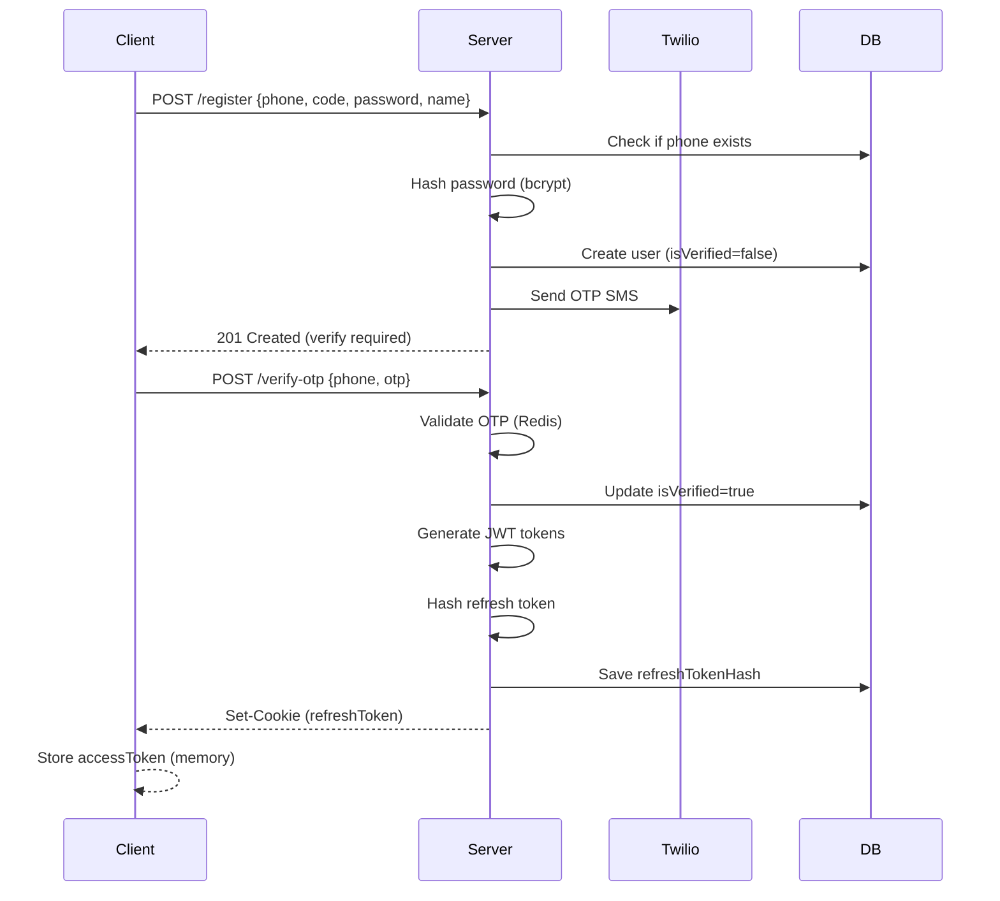

# 📱 WhatsApp Clone - Full Stack System (Backend)

**Production-ready** real-time messaging platform built with **Node.js**, **Express**, **MongoDB**, **Redis**, and **Socket.IO**. Supports 1:1 messaging, group chats, real-time presence, read receipts, media sharing, and end-to-end authentication flow.

---

## 🌐 Deployed URLs

- Frontend: `https://wattsapp-fronted.vercel.app`
- Backend: `https://wattsapp-backend.vercel.app`
- API base URL: `https://wattsapp-backend.vercel.app/api/v1`

Production CORS environment variables should point to the frontend domain:

```bash
CLIENT_URL=https://wattsapp-fronted.vercel.app
SOCKET_CORS_ORIGIN=https://wattsapp-fronted.vercel.app
```

The frontend should call its same-origin proxy with:

```bash
NEXT_PUBLIC_API_BASE_URL=/api/backend
BACKEND_API_BASE_URL=https://wattsapp-backend.vercel.app/api/v1
NEXT_PUBLIC_SOCKET_URL=https://wattsapp-backend.vercel.app
NEXT_PUBLIC_APP_URL=https://wattsapp-fronted.vercel.app
```

If `POST /api/v1/auth/register` returns validation errors, the endpoint path is correct. If it returns `500`, the failure is inside the registration service, most commonly MongoDB write access, Redis OTP storage, Twilio SMS configuration, or password hashing.

---

## 🎯 System Overview

### Architecture

**Backend Stack (This Repository)**
- **Runtime**: Node.js v20+ (ES Modules)
- **Framework**: Express.js v5
- **Database**: MongoDB (Mongoose ODM) + Redis (Caching & Pub/Sub)
- **Real-time**: Socket.IO with Redis Adapter (horizontal scaling)
- **Authentication**: JWT (Access: 15min, Refresh: 7d) + HttpOnly Cookies
- **Storage**: Cloudinary (Media assets)
- **Messaging**: Twilio SMS (OTP verification)
- **Validation**: Zod schemas

**Frontend Recommendation**
- React 18+ / Next.js 14+ (TypeScript)
- Socket.IO Client for real-time
- TanStack Query for data synchronization
- TailwindCSS / shadcn-ui

### High-Level Architecture Diagram

```

   Client
  (Web/Mobile)

        HTTPS (REST + WS)


     Express.js Server
    - Auth Routes & Logic
    - Message Routes
    - Group/Chat Management
    - Rate Limiting


        HTTP

                           WS (Socket.IO)


  MongoDB              Redis        Socket.IO
  (Primary)            (Cache)      (Pub/Sub)

 Users         Session    Horizontal Scaling
 Messages      Tokens     Across Instances
 Groups        OTP        Presence Sync
 Media         Online
 Receipts      Status
```

---

## 🚀 Core Features

### Authentication & Security
- ✅ **Phone-based Registration** - OTP via Twilio SMS
- ✅ **JWT Authentication** - Short-lived access tokens (15min) + long-lived refresh tokens (7d)
- ✅ **Token Rotation** - Automatic refresh token rotation on use
- ✅ **HttpOnly Cookie Storage** - Secure refresh token persistence
- ✅ **Token Blacklisting** - Redis-backed logout & session invalidation
- ✅ **Account Lockout** - 5 failed attempts → 2hr lock
- ✅ **Bcrypt Password Hashing** - Configurable salt rounds (default: 12)
- ✅ **Helmet.js Security Headers** - HSTS, CSP, XSS protection
- ✅ **CORS Restriction** - Whitelisted origins only
- ✅ **MongoDB Sanitization** - Query injection prevention
- ✅ **Zod Validation** - Type-safe request/response schemas

### Real-Time Messaging
- ✅ **1:1 Conversations** - Personal chat with typing indicators
- ✅ **Group Chats** - Create, manage, add/remove members, role-based permissions (owner/admin/member)
- ✅ **Message Types** - Text, images, files, voice notes, system messages
- ✅ **Media Upload** - Cloudinary integration with auto-optimization
- ✅ **Message Reactions** - Emoji reactions (real-time sync)
- ✅ **Reply to Messages** - Threaded conversations
- ✅ **Edit/Delete** - Message modification with audit trail

### Delivery & Read Receipts
- ✅ **Sent** - Message successfully sent to server
- ✅ **Delivered** - Message delivered to recipient's device
- ✅ **Read** - Message viewed by recipient
- ✅ **Per-User Tracking** - Individual receipt status in group chats

### Presence System
- ✅ **Online/Offline Status** - Real-time presence via Socket.IO
- ✅ **Last Seen** - Timestamp of last activity
- ✅ **Auto Status Sync** - Status propagation across all connected devices

### Group Management
- ✅ **Create Groups** - With name, description, avatar
- ✅ **Role-Based Access** - Owner, Admin, Member permissions
- ✅ **Member Management** - Add/remove users, promote/demote admins
- ✅ **Ownership Transfer** - Pass group ownership to another member
- ✅ **Leave Group** - Self-removal from group
- ✅ **Group Events** - Real-time notifications for all changes

---

## 📁 Project Structure

```
wattsapp-backend/
├── config/                    # Configuration
│   ├── db.config.js          # MongoDB connection (with retry logic)
│   ├── env.config.js         # Environment validation (Zod)
│   └── redis.config.js       # Redis client setup
├── controllers/              # Route controllers (thin layer)
│   ├── auth.controller.js    # Auth endpoints
│   ├── message.controller.js # Message endpoints
│   ├── group.controller.js   # Group chat endpoints
│   ├── block.controller.js   # Block/unblock users
│   └── readReceipt.controller.js # Receipt tracking
├── middlewares/              # Express middleware
│   ├── auth.middleware.js    # JWT verification
│   ├── error.middleware.js   # Global error handler
│   ├── rateLimiter.middleware.js # Rate limiting
│   └── validation.middleware.js  # Zod validation
├── models/                   # MongoDB schemas
│   ├── user.model.js         # User schema with hooks
│   ├── message.model.js      # Message with receipts
│   ├── conversation.model.js # 1:1 & group conversations
│   └── group.model.js        # Group metadata
├── routes/                   # Express routers
│   ├── auth.routes.js
│   ├── message.routes.js
│   ├── group.routes.js
│   └── block.routes.js
├── services/                 # Business logic
│   ├── auth.service.js       # All auth operations
│   ├── message.service.js    # Message CRUD & logic
│   ├── group.service.js      # Group operations
│   ├── block.service.js      # Block management
│   └── readReceipt.service.js # Receipt processing
├── socket/                   # Real-time handlers
│   ├── index.js              # Socket.IO setup & adapter
│   ├── handlers/
│   │   ├── message.handler.js  # Message events
│   │   ├── group.handler.js    # Group events
│   │   ├── readReceipt.handler.js # Receipt events
│   │   └── status.handler.js   # Presence events
│   └── middlewares/
│       └── auth.socket.js    # Socket authentication
├── utils/                    # Shared utilities
│   ├── ApiResponse.util.js   # Standardized responses
│   ├── ApiError.util.js      # Error classes
│   ├── cloudinary.util.js    # Media upload helpers
│   ├── hash.utils.js         # Bcrypt wrappers
│   ├── jwt.utils.js          # Token generation/verification
│   ├── otp.util.js           # OTP generation & SMS
│   └── onlineStatus.util.js  # Presence tracking
├── validation/               # Zod schemas
│   └── auth.validator.js
├── .env.example              # Environment template
├── server.js                 # Server startup & graceful shutdown
├── app.js                    # Express app configuration
└── package.json              # Dependencies & scripts
```

---

## 🛠️ Tech Stack Deep Dive

| Layer | Technology | Purpose |
|-------|-----------|----------|
| **Runtime** | Node.js v20+ | JavaScript runtime with native ES modules |
| **Framework** | Express.js v5 | HTTP server & routing |
| **Database** | MongoDB 7.x | Primary data store (documents) |
| | Mongoose 9.x | ODM with schemas, hooks, middleware |
| **Cache/Queue** | Redis 7.x | Session storage, presence, pub/sub |
| **Real-time** | Socket.IO 4.x | WebSocket with fallbacks, rooms, broadcasting |
| | Redis Adapter | Horizontal scaling for Socket.IO |
| **Auth** | JWT 9.x | Token-based authentication |
| | Bcrypt 6.x | Password hashing |
| | HttpOnly Cookies | Secure token storage |
| **SMS** | Twilio 4.x | OTP delivery for phone verification |
| **Storage** | Cloudinary 2.x | Media upload & CDN delivery |
| **Validation** | Zod 3.x | Runtime type checking & validation |
| **Security** | Helmet 8.x | HTTP security headers |
| | CORS 2.x | Cross-origin resource sharing control |
| | Express-rate-limit 7.x | Rate limiting middleware |
| | Express Mongo Sanitize 2.x | Query injection protection |
| **DevTools** | Nodemon | Auto-reload in dev |
| | ESLint + Prettier | Code quality & formatting |
| | Husky + commitlint | Git hooks & commit conventions |

---

## 📡 API Endpoints

### Authentication Routes (`/api/v1/auth/`)

| Method | Endpoint | Auth | Description |
|--------|----------|------|-------------|
| `POST` | `/register` | Public | Register new user with phone |
| `POST` | `/verify-otp` | Public | Verify phone with OTP code |
| `POST` | `/resend-otp` | Public | Resend OTP (rate limited) |
| `POST` | `/login` | Public | Login with phone/password |
| `POST` | `/refresh-token` | Public | Rotate access token |
| `POST` | `/logout` | Public | Invalidate refresh token |
| `POST` | `/forgot-password` | Public | Request password reset OTP |
| `POST` | `/reset-password` | Public | Reset password with OTP |
| `GET` | `/profile` | 🔒 Bearer | Get current user profile |
| `PATCH` | `/profile` | 🔒 Bearer | Update display name |
| `PATCH` | `/avatar` | 🔒 Bearer | Upload/update avatar (multipart) |
| `DELETE` | `/account` | 🔒 Bearer | Deactivate account |

### Message Routes (`/api/v1/messages/`)

| Method | Endpoint | Auth | Description |
|--------|----------|------|-------------|
| `POST` | `/conversations` | 🔒 Bearer | Create new conversation |
| `GET` | `/conversations` | 🔒 Bearer | List user conversations (paginated) |
| `GET` | `/conversations/:id` | 🔒 Bearer | Get conversation by ID |
| `DELETE` | `/conversations/:id` | 🔒 Bearer | Delete conversation |
| `POST` | `/:convoId/messages` | 🔒 Bearer | Send text/media message |
| `POST` | `/:convoId/media` | 🔒 Bearer | Upload media-only message |
| `GET` | `/:convoId/messages` | 🔒 Bearer | Get messages (paginated + cursor) |
| `PATCH` | `/:convoId/messages/:id` | 🔒 Bearer | Edit message text |
| `DELETE` | `/:convoId/messages/:id` | 🔒 Bearer | Delete message |
| `POST` | `/:convoId/read/:msgId` | 🔒 Bearer | Mark messages as read |
| `POST` | `/:convoId/delivered/:msgId` | 🔒 Bearer | Mark as delivered |
| `POST` | `/:convoId/reactions/:msgId` | 🔒 Bearer | Add/remove reaction |

### Group Routes (`/api/v1/groups/`)

| Method | Endpoint | Auth | Description |
|--------|----------|------|-------------|
| `POST` | `/` | 🔒 Bearer | Create group |
| `GET` | `/` | 🔒 Bearer | Get user's groups |
| `GET` | `/:id` | 🔒 Bearer | Get group details |
| `PATCH` | `/:id` | 🔒 Bearer | Update group (admin only) |
| `POST` | `/:id/members` | 🔒 Bearer | Add members (admin+) |
| `DELETE` | `/:id/members/:uid` | 🔒 Bearer | Remove member (admin+) |
| `PATCH` | `/:id/promote/:uid` | 🔒 Bearer | Promote to admin |
| `PATCH` | `/:id/demote/:uid` | 🔒 Bearer | Demote from admin |
| `PATCH` | `/:id/transfer` | 🔒 Bearer | Transfer ownership |
| `POST` | `/:id/leave` | 🔒 Bearer | Leave group |

### Block Routes (`/api/v1/blocks/`)

| Method | Endpoint | Auth | Description |
|--------|----------|------|-------------|
| `POST` | `/` | 🔒 Bearer | Block user |
| `DELETE` | `/:userId` | 🔒 Bearer | Unblock user |
| `GET` | `/` | 🔒 Bearer | List blocked users |

### Infrastructure

| Method | Endpoint | Description |
|--------|----------|-------------|
| `GET` | `/health` | Health check (DB, Redis, Socket) |

---

## 🔐 Authentication Flow

### Phone Registration


### Token Rotation
- Access token expires in **15 minutes**
- Refresh token expires in **7 days**
- On refresh: new access token issued, refresh token rotated
- Previous refresh token invalidated after use
- Compromised token detection via hash comparison

---

## 📐 Database Schema

### User Schema (`models/user.model.js`)
```javascript
{
  phone: String,              // +1234567890 (unique, indexed)
  countryCode: String,        // ISO country code
  password: String,           // bcrypt hash
  displayName: String,        // Display name (2-50 chars)
  avatar: {
    url: String,
    publicId: String          // Cloudinary ID
  },
  isVerified: Boolean,        // OTP verification status
  isActive: Boolean,          // Account deactivation
  isOnline: Boolean,          // Real-time presence
  role: String,               // 'user' | 'admin'
  lastSeen: Date,             // Last activity timestamp
  refreshTokenHash: String,   // Server-side token storage
  loginAttempts: Number,      // Failed login counter
  lockUntil: Date             // Account lock timestamp
}
```

### Message Schema (`models/message.model.js`)
```javascript
{
  conversationId: ObjectId,   // Reference to conversation
  senderId: ObjectId,         // Reference to user
  text: String,               // Message content (4096 max)
  messageType: String,        // 'text' | 'image' | 'file' | 'voice' | 'system'
  mediaUrl: String,           // Cloudinary URL
  mediaMimeType: String,      // MIME type
  mediaSize: Number,          // File size in bytes
  status: String,             // 'sent' | 'delivered' | 'read' | 'failed'
  receiptStatus: [{
    userId: ObjectId,         // Per-user receipt tracking
    deliveredAt: Date,
    readAt: Date
  }],
  replyTo: ObjectId,          // Reference to parent message
  reactions: [{
    userId: ObjectId,
    emoji: String
  }],
  isEdited: Boolean,          // Edit tracking
  isDeleted: Boolean          // Soft delete flag
}
```

### Conversation Schema (`models/conversation.model.js`)
```javascript
{
  type: String,               // 'direct' | 'group'
  participants: [ObjectId],   // User references
  groupName: String,          // (if type == 'group')
  groupAvatar: String,
  description: String,
  admins: [ObjectId],         // Admin user references
  creatorId: ObjectId,        // Group creator
  isArchived: Boolean
}
```

---

## 🔧 Installation & Setup

### Prerequisites
```bash
# Required
Node.js >= 20.0.0
MongoDB >= 7.0.0
Redis >= 7.0.0

# Optional (for full features)
Twilio Account (SMS)
Cloudinary Account (Media storage)
```

### Environment Configuration

```bash
# Copy template
cp .env.example .env

# Edit .env
nano .env
```

```env
# ======================
# Server Configuration
# ======================
NODE_ENV=development
PORT=3000

# ======================
# Database (MongoDB)
# ======================
MONGODB_URI=mongodb://localhost:27017/wattsapp

# ======================
# Cache (Redis)
# ======================
REDIS_URL=redis://localhost:6379

# ======================
# JWT Authentication
# ======================
ACCESS_TOKEN_SECRET=your-super-secret-key-min-32-chars-here
REFRESH_TOKEN_SECRET=different-super-secret-key-min-32-chars

# ======================
# Password Security
# ======================
BCRYPT_SALT_ROUNDS=12

# ======================
# Twilio SMS (OTP)
# ======================
TWILIO_ACCOUNT_SID=your_twilio_sid
TWILIO_AUTH_TOKEN=your_twilio_auth_token
TWILIO_PHONE_NUMBER=+1234567890

# ======================
# Cloudinary (Media)
# ======================
CLOUDINARY_CLOUD_NAME=your_cloud_name
CLOUDINARY_API_KEY=your_api_key
CLOUDINARY_API_SECRET=your_api_secret

# ======================
# CORS
# ======================
CLIENT_URL=http://localhost:5173
SOCKET_CORS_ORIGIN=http://localhost:5173

# ======================
# Optional: Stripe
# ======================
STRIPE_SECRET_KEY=sk_test_...
```

### Installation Steps

```bash
# 1. Clone repository
git clone <repository-url>
cd wattsapp-backend

# 2. Install dependencies
npm install

# 3. Start MongoDB & Redis
# Option A: Docker (recommended)
docker run -d -p 27017:27017 --name mongodb mongo:7
docker run -d -p 6379:6379 --name redis redis:7

# Option B: Local installation
brew install mongodb-community redis  # macOS
sudo apt install mongodb redis-server  # Ubuntu

# 4. Start services
mongod --dbpath /data/db
redis-server

# 5. Run development server
npm run dev

# 6. Verify
curl http://localhost:3000/health
```

---

## 🚦 Running the Application

### Development
```bash
npm run dev         # Nodemon with auto-reload
npm run lint        # ESLint check
npm run lint:fix    # Auto-fix lint errors
npm run format      # Prettier formatting
```

### Production
```bash
npm run build       # (if using TypeScript/transpilation)
npm start           # Production server
```

### Testing
```bash
# Tests use Jest (configure as needed)
npm test            # Run all tests
npm test -- --watch # Watch mode
```

---

## ⚡ Rate Limiting

| Endpoint | Limit | Window |
|----------|-------|--------|
| `POST /login` | 5 requests | 15 minutes |
| `POST /register` | 3 requests | 1 hour |
| `POST /verify-otp` | 3 requests | 5 minutes |
| `POST /resend-otp` | 2 requests | 10 minutes |
| `POST /forgot-password` | 3 requests | 30 minutes |
| All other routes | 10 req/s | 1 minute |

---

## 🔒 Security Best Practices

### Implemented
- ✅ Passwords hashed with bcrypt (salt rounds: 12)
- ✅ JWT tokens with separate secrets for access/refresh
- ✅ Refresh tokens stored as HttpOnly cookies (XSS protection)
- ✅ CSRF protection via SameSite=Strict cookies
- ✅ Token blacklisting on logout (Redis)
- ✅ Account lockout after 5 failed attempts
- ✅ Helmet.js security headers
- ✅ CORS restricted to whitelisted origins
- ✅ Input validation with Zod (no injection)
- ✅ MongoDB query sanitization
- ✅ Rate limiting on auth endpoints
- ✅ Session invalidation on password change
- ✅ Secure token generation (crypto.randomBytes)

### Recommended (Frontend)
- 🔒 Store access token in memory (not localStorage)
- 🔒 Implement silent token refresh
- 🔒 Use HTTPS in production
- 🔒 Implement CSP headers
- 🔒 Add 2FA for sensitive operations

---

## 📈 Scalability

### Horizontal Scaling
```

                  Load Balancer
                  (Nginx/HAProxy)


   Server 1            Server 2          Server N
   Node.js             Node.js           Node.js


                   Redis (Shared)
        (Socket.IO Adapter + Session Store)


                   MongoDB
                 (Replica Set)

```

- **Redis Pub/Sub** synchronizes Socket.IO across instances
- **MongoDB Replica Set** for high availability
- **Stateless design** allows unlimited server instances
- **Connection pooling** reduces DB overhead

---

## 📊 Performance Optimization

### Database
- Indexed fields: `phone`, `conversationId`, `senderId`, `lastSeen`
- Virtuals for computed properties (isLocked)
- Query optimization with lean() where appropriate
- Pagination on all list endpoints (cursor-based for messages)

### Caching
- Redis for OTP storage (TTL: 5-10 minutes)
- Redis for token blacklist (TTL: 7 days)
- Redis for online status (TTL: 30 seconds)

### File Upload
- Cloudinary CDN for fast media delivery
- Auto-resize images (200x200 for avatars)
- Client-side compression before upload

---

## 🐛 Error Handling

### Standard Response Format

**Success:**
```json
{
  "success": true,
  "statusCode": 200,
  "message": "Operation successful",
  "data": { ... },
  "timestamp": "2024-01-01T00:00:00.000Z"
}
```

**Error:**
```json
{
  "success": false,
  "statusCode": 400,
  "message": "Invalid phone number format",
  "timestamp": "2024-01-01T00:00:00.000Z"
}
```

### Error Classes
- `ApiError` - Application-level errors (4xx)
- `HttpStatus` - Consistent status codes
- Global error middleware for uncaught exceptions

---

## 📝 Development Guide

### Code Style
- **ESLint** - Airbnb base with custom rules
- **Prettier** - Consistent formatting
- **ES Modules** - Native import/export (no CommonJS)
- **Async/Await** - No callbacks
- **express-async-handler** - Automatic error catching

### Git Workflow
```bash
# Branch naming
feature/xxx-description
fix/xxx-description
hotfix/xxx-description

# Commits (Conventional Commits)
git commit -m "feat: add group chat reactions"
git commit -m "fix: resolve message delivery bug"
git commit -m "docs: update API documentation"

# Hooks
Husky runs pre-commit (lint-staged)
```

### Adding New Feature
1. Create feature branch
2. Write Zod schemas in `validation/`
3. Add routes in `routes/`
4. Implement controller in `controllers/`
5. Add business logic in `services/`
6. Update models if needed
7. Add tests
8. Update this README
9. PR with description

---

## 🌐 Socket.IO Events

### Client → Server
| Event | Payload | Description |
|-------|---------|-------------|
| `join_conversation` | `{ conversationId }` | Join conversation room |
| `leave_conversation` | `{ conversationId }` | Leave conversation room |
| `send_message` | `{ conversationId, text, replyTo }` | Send new message |
| `message_read` | `{ conversationId, messageId }` | Mark as read |
| `typing_start` | `{ conversationId }` | Typing indicator start |
| `typing_stop` | `{ conversationId }` | Typing indicator stop |
| `update_status` | `{ status }` | Update online status |

### Server → Client
| Event | Payload | Description |
|-------|---------|-------------|
| `new_message` | `Message` | New message received |
| `message_deleted` | `{ messageId }` | Message deleted |
| `message_edited` | `Message` | Message edited |
| `message_read` | `{ messageIds, readBy }` | Messages read |
| `message_delivered` | `{ messageId }` | Message delivered |
| `user_online` | `{ userId }` | User came online |
| `user_offline` | `{ userId }` | User went offline |
| `group_updated` | `Group` | Group details updated |
| `group_member_added` | `Group` | Member added to group |
| `error` | `{ message }` | Error notification |

---

## 📖 Key Implementation Details

### Message Delivery Flow
1. Client sends message via REST or Socket
2. Server saves to MongoDB
3. Server emits `new_message` to conversation room
4. Recipient receives via Socket
5. Client sends `message_delivered` receipt
6. Server updates message status
7. Client sends `message_read` when viewed

### Presence System
- Online status tracked via Socket.IO connection state
- `lastSeen` updated on disconnect
- Heartbeat every 30s to detect stale connections
- Redis stores transient status for multi-instance sync

### Group Permissions
| Action | Owner | Admin | Member |
|--------|-------|-------|--------|
| Edit group | ✅ | ✅ | ❌ |
| Delete group | ✅ | ❌ | ❌ |
| Add members | ✅ | ✅ | ❌ |
| Remove members | ✅ | ✅* | ❌ |
| Promote/demote | ✅ | ❌ | ❌ |
| Transfer ownership | ✅ | ❌ | ❌ |
| Leave group | ✅ | ✅ | ✅ |

*Admins cannot remove owner or other admins

### OTP Storage
- Generated: 6-digit numeric code
- Storage: Redis (key: `otp:{phone}`)
- TTL: 5 minutes
- Resend limit: 3 attempts per 10 minutes
- Invalidated after successful verification

---

## 🚨 Monitoring & Logging

### Production Checklist
- [ ] Add Winston/Morgan for request logging
- [ ] Integrate Sentry for error tracking
- [ ] Add Prometheus metrics endpoint
- [ ] Set up MongoDB slow query log (>100ms)
- [ ] Monitor Redis memory usage
- [ ] Configure log rotation
- [ ] Add health check for all services
- [ ] Implement circuit breakers (optional)
- [ ] Set up backup for MongoDB
- [ ] Configure SSL/TLS certificates

---

## 🤝 Contributing

1. Fork the repository
2. Create feature branch (`git checkout -b feature/AmazingFeature`)
3. Commit changes (`git commit -m 'Add: AmazingFeature'`)
4. Push to branch
5. Open Pull Request

### Commit Convention
Follow [Conventional Commits](https://www.conventionalcommits.org/):
- `feat:` New feature
- `fix:` Bug fix
- `docs:` Documentation
- `style:` Formatting
- `refactor:` Code change (no feature/fix)
- `test:` Tests
- `chore:` Build tasks

---

## 📄 License

MIT License - Copyright (c) 2024 Muhammad Umar

Permission is hereby granted, free of charge, to any person obtaining a copy... (see LICENSE file)

---

## 👤 Author

**Muhammad Umar**
- GitHub: [@umarxcodes](https://github.com/umarxcodes)
- Project: wattsapp-backend

---

## 🔗 Related Projects

- [wattsapp-frontend](https://github.com/umarxcodes/wattsapp-frontend) - React frontend
- [wattsapp-docs](https://github.com/umarxcodes/wattsapp-docs) - API documentation

---

## ⭐ Support

If you find this project helpful, please consider starring ⭐️ the repository!

---

**Last Updated:** April 2026
**Version:** 1.0.0
**Node.js:** v20+
**Type:** Full Stack WhatsApp Clone Backend
